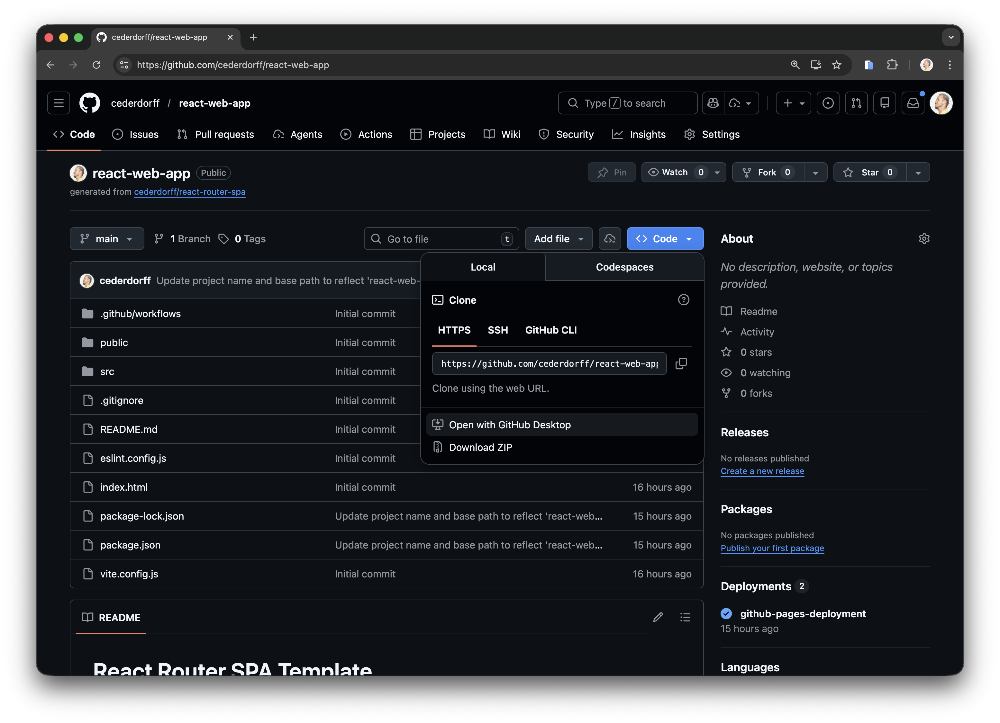

# Samarbejdsguide: Git, GitHub, branches & Pull Requests

Del 2 af onboarding-guiden: fokus på samarbejde i team med branches, Pull Requests og sikker merge til `main`.
Del 1 findes i [template-to-github-pages-setup.md](template-to-github-pages-setup.md), hvor I opretter repository fra template og sætter deployment op på GitHub Pages.

Formål med guiden:

- invitere collaborators til repository
- arbejde i egne branches
- committe og pushe via VS Code
- oprette og reviewe Pull Requests
- merge sikkert til `main`
- verificere deployment på GitHub Pages

Vigtig regel: Arbejd aldrig direkte på `main`.
`main` skal altid være stabil, fordi den deployes automatisk.
Lav derfor ændringer i feature-branches og merge via Pull Requests.

## Del 1: Inviter collaborators

### Step 1.1: Inviter kollega(er)

Repository-ejer inviterer gruppemedlemmer som collaborators:

> **Begreb: Collaborator**  
> En collaborator er en person, der har adgang til at arbejde i repository'et.

1. Gå til repository på GitHub.
2. Klik på **Settings**.
3. Klik på **Collaborators** i venstre menu.
4. Klik **Add people**.
5. Indtast GitHub-brugernavn eller e-mail på dine gruppemedlemmer.
6. Klik **Add [navn] to this repository**.
   

### Step 1.2: Alle collaborators cloner repository

Alle i gruppen:

1. Accepter invitationen.
2. Clone projektet med **Code** -> **Open with GitHub Desktop**.
   
3. Åbn projektet i VS Code.
4. Kør:

```bash
npm install
npm run dev
```

5. Åbn lokal URL i browser og test at løsningen kører.
   
6. Brug 2-3 minutter på at gennemgå projektet, så alle ved hvad templaten allerede kan.
   Tjek især `HomePage`, hvor billeder vises på tre måder:
   - **Import fra `src/assets`**: bruges til billeder, der er en del af appens kodebase. Vite håndterer dem i build-processen.
   - **Fil fra `public`**: bruges til statiske filer, der skal ligge med fast sti (fx logo/favicons), uden import i komponenten.
   - **Ekstern URL**: bruges når billedet kommer fra en ekstern kilde/API, og ikke ligger i jeres repository.

### Step 1.3: Fordel opgaver i gruppen

Arbejd på forskellige features samtidig:

| Person     | Branch navn                 | Feature           | Beskrivelse                  |
| ---------- | --------------------------- | ----------------- | ---------------------------- |
| _Person A_ | `feature/add-footer`        | Footer komponent  | Tilføj footer med copyright  |
| _Person B_ | `feature/improve-homepage`  | Forbedre HomePage | Tilføj hero-sektion og cards |
| _Person C_ | `feature/add-services-page` | Services-side     | Ny side med services         |
| _Person D_ | `feature/style-about-page`  | Style About-side  | Forbedre About layout        |

Hvis I er 3 personer, vælg tre features og gem den sidste til senere.

## Del 2: Samarbejde med branches og Pull Requests

> **Begreb: Branch**  
> En branch er en separat arbejdsgren af koden, hvor du kan lave ændringer uden at påvirke `main`.  
> Når ændringen er klar, sendes den til `main` via en Pull Request.

### Step 2.1: Opret din branch (i VS Code)

1. Tjek at du står på `main` nederst til venstre i VS Code.
2. Hvis ikke, klik på branch-navnet og vælg `main`.
3. Klik **Sync Changes** (de cirkulære pile nederst til venstre), så din `main` er opdateret.
4. Klik på branch-navnet nederst til venstre igen.
5. Vælg **Create new branch...**.
6. Skriv dit branch-navn fra tabellen, fx `feature/add-footer`, og tryk Enter.
   
   > **Begreb: `Sync Changes`**  
   > `Sync Changes` henter nye ændringer fra GitHub og pusher dine egne ændringer op.

### Step 2.2: Implementer din feature

#### Person A: Footer komponent

Opret `src/components/Footer.jsx`:

```jsx
export default function Footer() {
  return (
    <footer>
      <p>&copy; 2026 - Lavet af [DIT NAVN]</p>
    </footer>
  );
}
```

Opdater `src/App.jsx` (tilføj `<Footer />` under Routes):

```jsx
import { Routes, Route } from "react-router";
import Navbar from "./components/Navbar";
import Footer from "./components/Footer";
import HomePage from "./pages/HomePage";
import AboutPage from "./pages/AboutPage";
import ContactPage from "./pages/ContactPage";
import NotFoundPage from "./pages/NotFoundPage";

export default function App() {
  return (
    <>
      <Navbar />
      <Routes>
        <Route path="/" element={<HomePage />} />
        <Route path="/about" element={<AboutPage />} />
        <Route path="/contact" element={<ContactPage />} />
        <Route path="*" element={<NotFoundPage />} />
      </Routes>
      <Footer />
    </>
  );
}
```

Tilføj styling i `src/styles.css`:

```css
footer {
  margin-top: 2rem;
  padding: 1rem;
  text-align: center;
  border-top: 1px solid rgba(255, 255, 255, 0.2);
  color: rgba(255, 255, 255, 0.8);
}
```

#### Person B: Forbedre HomePage

Opdater `src/pages/HomePage.jsx` med en introduktion og tre feature-kort, men behold billedsektionen:

```jsx
import reactRouterLogo from "../assets/example.svg";

export default function HomePage() {
  return (
    <>
      <header>
        <h1>Home</h1>
        <p className="home-intro">Welcome to our React Router project.</p>
      </header>
      <main>
        <section className="home-features">
          <article className="feature-card">
            <h3>Routing</h3>
            <p>Navigate between pages with React Router.</p>
          </article>
          <article className="feature-card">
            <h3>Components</h3>
            <p>Build reusable UI components for each page.</p>
          </article>
          <article className="feature-card">
            <h3>Deployment</h3>
            <p>Deploy automatically to GitHub Pages.</p>
          </article>
        </section>

        <article>
          <h2>Displaying images in React</h2>

          <h3>1. Import from src/assets</h3>
          

          <h3>2. Public folder</h3>
          

          <h3>3. External URL</h3>
          
        </article>
      </main>
    </>
  );
}
```

Tilføj styling i `src/styles.css`:

```css
.home-intro {
  color: rgba(255, 255, 255, 0.8);
  margin-top: 0.5rem;
}

.home-features {
  display: grid;
  grid-template-columns: repeat(auto-fit, minmax(220px, 1fr));
  gap: 1.25rem;
  margin-top: 1rem;
}

.feature-card {
  background: rgba(255, 255, 255, 0.07);
  border: 1px solid rgba(255, 255, 255, 0.2);
  border-radius: 8px;
  padding: 1.25rem;
}
```

#### Person C: Services-side

Opret `src/pages/ServicesPage.jsx`:

```jsx
export default function ServicesPage() {
  return (
    <>
      <header>
        <h1>Services</h1>
      </header>
      <main className="services-grid">
        <article className="service-card">
          <h3>Web Development</h3>
          <p>Custom websites and frontend solutions.</p>
        </article>
        <article className="service-card">
          <h3>UX/UI Design</h3>
          <p>Design of user-friendly digital interfaces.</p>
        </article>
        <article className="service-card">
          <h3>Consulting</h3>
          <p>Technical guidance and architecture support.</p>
        </article>
      </main>
    </>
  );
}
```

Opdater `src/App.jsx` (vises som hele filen):

```jsx
import { Routes, Route } from "react-router";
import Navbar from "./components/Navbar";
import HomePage from "./pages/HomePage";
import AboutPage from "./pages/AboutPage";
import ContactPage from "./pages/ContactPage";
import ServicesPage from "./pages/ServicesPage";
import NotFoundPage from "./pages/NotFoundPage";

export default function App() {
  return (
    <>
      <Navbar />
      <Routes>
        <Route path="/" element={<HomePage />} />
        <Route path="/about" element={<AboutPage />} />
        <Route path="/contact" element={<ContactPage />} />
        <Route path="/services" element={<ServicesPage />} />
        <Route path="*" element={<NotFoundPage />} />
      </Routes>
    </>
  );
}
```

Opdater `src/components/Navbar.jsx` (indsæt `Services`-link mellem `About` og `Contact`):

```jsx
<NavLink to="/services">Services</NavLink>
```

Tilføj styling i `src/styles.css`:

```css
.services-grid {
  display: grid;
  grid-template-columns: repeat(auto-fit, minmax(240px, 1fr));
  gap: 1rem;
}

.service-card {
  padding: 1.25rem;
  border-radius: 12px;
  background: rgba(255, 255, 255, 0.08);
  border: 1px solid rgba(255, 255, 255, 0.15);
}
```

#### Person D: Style About-side

Opdater `src/pages/AboutPage.jsx` med mere indhold:

```jsx
export default function AboutPage() {
  return (
    <>
      <header>
        <h1>About</h1>
      </header>
      <main className="about-container">
        <p>We build modern web apps with React, clear branching, and structured Pull Requests.</p>

        <section className="about-stats">
          <article className="stat">
            <h3>12+</h3>
            <p>Projects</p>
          </article>
          <article className="stat">
            <h3>4</h3>
            <p>Team Members</p>
          </article>
          <article className="stat">
            <h3>100%</h3>
            <p>Deployed</p>
          </article>
        </section>
      </main>
    </>
  );
}
```

Tilføj styling i `src/styles.css`:

```css
.about-container {
  max-width: 760px;
}

.about-stats {
  display: grid;
  grid-template-columns: repeat(auto-fit, minmax(160px, 1fr));
  gap: 0.75rem;
  margin-top: 1rem;
}

.stat {
  text-align: center;
  padding: 1rem;
  border-radius: 8px;
  background: #4a50c7;
  color: #fff;
}
```

### Step 2.3: Test lokalt

```bash
npm run dev
```

- Tjek ændringerne i browseren, før du pusher.

> Vi skal sikre at `main` altid er stabil, så det er vigtigt at teste lokalt først. ALTID!

### Step 2.4: Commit din ændring

VS Code Source Control:

1. Klik på **Source Control** i venstre side (eller `Ctrl+Shift+G` / `Cmd+Shift+G`).
2. Gennemgå filerne under **Changes**. Ser det rigtigt ud?
   
3. Skriv commit-besked i feltet **Message**.
4. Klik **Commit**.

Forslag til beskeder:

- `feat: add footer component`
- `feat: improve homepage hero section`
- `feat: add services page and route`
- `feat: restyle about page`
  
  Du kan bruge Copilot til commit-beskeder, men behold dem korte og beskrivende.

### Step 2.5: Push branch

VS Code Source Control:

1. Klik **Publish Branch** (første gang), eller **Sync Changes**.
2. Bekræft at branchen pushes til `origin`.

### Step 2.6: Opret Pull Request

En Pull Request (PR) bruges til at få ændringer fra din feature-branch ind i `main` på en sikker måde (merge).

Kort flow:

- Du arbejder i din feature-branch.
- Du opretter en PR til `main`.
- Teamet reviewer og godkender.
- Derefter merges PR'en til `main` (som deployes).

> Kort sagt: **branch = arbejde**, **PR = review**, **main = stabil/deployet kode**.

Sådan opretter du PR'en på GitHub:

1. Gå til repository på GitHub.
2. Klik **Compare & pull request** (typisk synlig lige efter push).
   
3. Hvis knappen ikke vises: gå til **Pull requests** -> **New pull request**.
4. Sæt `base` til `main` og `compare` til din feature-branch.
5. Tjek ændringerne og klik **Create pull request**.
6. Giv PR'en en kort titel og beskrivelse, og klik **Create pull request** igen.
   

Brug denne enkle PR-skabelon i beskrivelsen:

- **Hvad er ændret?** (1-3 punkter)
- **Hvordan er det testet?** (fx `npm run dev` lokalt)

Efter PR'en er oprettet:

1. Bekræft at PR'en ser korrekt ud (filer, titel, beskrivelse).
   
2. Bed en anden i gruppen om at reviewe PR'en (se step 2.7).
3. Når PR'en er godkendt, klik **Merge pull request**.
4. Tjek merge-dialogen og klik **Confirm merge**:
   
5. Bekræft at status viser merged.
   
6. Klik evt. **Delete branch**, hvis feature-branchen ikke længere skal bruges.

Tip: Det er bedst, at en anden end forfatteren selv merger PR'en.

### Step 2.7: Review hinandens PRs

> **Begreb: Review og Approve**  
> Et review er en gennemgang af PR'ens ændringer.  
> Approve betyder, at PR'en er klar til merge.

Hold review simpelt:

1. Gå til fanen **Pull requests**:
   
2. Åbn PR'en.
   
3. Gå til fanen **Files changed**:
   
   Brug denne fane til selve reviewet: her kan du se præcis hvilke linjer der er ændret, og kommentere direkte i koden.
4. Tjek at PR'en:
   - har en kort beskrivelse
   - er testet lokalt
   - ikke overlapper tydeligt med andres ændringer
5. Klik **Review changes** og vælg **Approve**, eller skriv en kort kommentar.
6. Gå tilbage til fanen **Conversation**, så PR'en kan merges i næste step (Step 2.8: Merge PRs en ad gangen).
   

Tip: Filtrér på **Open**, så I kun ser aktive PRs.

### Step 2.8: Merge PRs en ad gangen

Merge PRs én ad gangen for at minimere konflikter.

> **Begreb: Merge**  
> Merge betyder at samle ændringer fra en branch/PR ind i `main`.

Sådan merger I PR'en:

1. Åbn PR'en i fanen **Conversation**.
2. Bekræft at PR'en er reviewed/godkendt.
3. Klik **Merge pull request**.
   
4. Klik **Confirm merge**.
   
5. Bekræft at status viser merged.
   
6. Klik evt. **Delete branch**, hvis branchen ikke længere skal bruges.

Tip: Lad gerne en anden end forfatteren stå for merge.

### Step 2.9: Når PR er merged, opdater din lokale `main`

VS Code Source Control:

1. Skift til branch `main`.
2. Klik **Sync Changes** (de cirkulære pile nederst til venstre) for at hente den mergede ændring ned lokalt.
3. Test appen:

```bash
npm run dev
```

4. Når appen virker, kan du starte næste opgave i en ny feature-branch.

### Step 2.10: Ryd op i din feature-branch

Når din PR er merged:

1. Slet branchen på GitHub med **Delete branch** i PR'en.
2. Skift lokalt til `main`.
3. Slet den lokale feature-branch i VS Code (Branch-menu -> **Delete Branch...**).

Hvis PR'en ikke kan merges pga. konflikt, opdater feature-branch med `main` først (næste step).

### Step 2.11: Merge `main` ind i din feature-branch (kun når nødvendigt)

Hvorfor:

- din branch får de nyeste ændringer fra holdet
- konflikter løses før PR-merge

Hvornår:

- når GitHub viser **out of date**
- når PR'en har merge-konflikt
- når flere PRs er merged siden du startede

> **Begreb: Out of date**  
> Det betyder, at din branch mangler nyere ændringer fra `main`.

Hvordan (VS Code):

1. Skift til `main`.
2. Klik **Sync Changes**.
3. Skift tilbage til din feature-branch.
4. Åbn Command Palette (`Cmd+Shift+P` / `Ctrl+Shift+P`).
5. Vælg **Git: Merge Branch...** og vælg `main`.
6. Løs evt. konflikter i editoren, commit, og klik **Sync Changes**.

### Step 2.12: Øvelse - simulér en merge-konflikt

Prøv en kontrolleret konflikt og løs den i VS Code.

Opsætning:

1. Person A opretter branch `feature/conflict-a`.
2. Person B opretter branch `feature/conflict-b`.
3. Begge redigerer **samme linje** i samme fil, fx i `src/pages/HomePage.jsx`:
   - linjen med teksten `Welcome to the home page.`
4. Person A ændrer teksten til:
   - `Welcome to the home page - version A`
5. Person B ændrer teksten til:
   - `Welcome to the home page - version B`

Forløb:

1. Person A committer, pusher og merger sin PR først.
2. Person B laver PR bagefter.
3. GitHub viser typisk konflikt, fordi samme linje er ændret forskelligt.

Løsning i VS Code (Person B):

1. Skift til `main` og klik **Sync Changes**.
2. Skift tilbage til `feature/conflict-b`.
3. Kør **Git: Merge Branch...** og vælg `main`.
4. Åbn konfliktfilen i editoren.
5. Vælg en løsning:
   - **Accept Current Change** (behold din branch)
   - **Accept Incoming Change** (behold `main`)
   - **Accept Both Changes** (behold begge, og redigér manuelt bagefter)
6. Gem filen, commit konfliktløsningen og klik **Sync Changes**.
7. Gå tilbage til PR'en og merge.

Kort opsummering af PR-flow:

1. Alle laver branch + PR.
2. PRs reviewes kort og merges én ad gangen.
3. Efter merge synkroniserer alle lokal `main`.

### 2.13: Verificer automatisk deploy efter merge

Efter hver merge til `main`:

> **Begreb: Workflow og Deploy**  
> Et workflow i GitHub Actions er en automatisk proces, der bygger og udgiver projektet.  
> Deploy er den live version af appen på GitHub Pages.

1. Gå til **Actions** i GitHub-repositoriet.
2. Find seneste deploy-workflow for `main`.
3. Bekræft at workflow ender med grøn status.
4. Åbn jeres GitHub Pages URL.
5. Opdatér siden og tjek at ændringen er synlig live.

## Del 3: Best Practices

### Gode commit-beskeder

Her skal du blot læse og forstå, hvordan gode commit-beskeder ser ud. De skal være korte, præcise og følge et mønster.

Godt:

- `feat: add contact form validation`
- `fix: resolve navbar active state bug`
- `docs: add collaboration walkthrough`

Undgå:

- `changes`
- `fix`
- `update`

### Branch naming

- `feature/...` ny funktionalitet
- `fix/...` fejlrettelser
- `chore/...` maintenance
- `refactor/...` intern omstrukturering

### Pull Request best practices

1. En feature per PR.
2. Hold PRs små.
3. Test altid for PR.
4. Hold beskrivelsen kort: hvad er ændret og hvordan er det testet.

### Main branch-regel

1. Push ikke direkte til `main`.
2. Arbejd altid i en feature-branch.
3. Merge kun til `main`, når ændringen er testet og klar.

## Del 4: Troubleshooting

Ikke en øvelse, men en tjekliste til at løse almindelige problemer.

### Problem: GitHub Pages viser 404

Tjek:

1. `package.json` har korrekt `base`, fx `/react-router-spa/`
2. `src/main.jsx` bruger `basename={import.meta.env.BASE_URL}`
3. GitHub Pages er sat til **GitHub Actions**
4. Deployment workflow er grønt i **Actions**

### Problem: Routing virker ikke på GitHub Pages

Tjek at routes lever i `src/App.jsx` og at deployment bygger med korrekt `base`.

### Problem: CSS eller billeder mangler

1. Tjek stier i komponenter.
2. Kør:

```bash
npm run build
```

3. Push igen og vent på ny deploy.

### Problem: `npm install` fejler

1. Tjek Node-version:

```bash
node -v
```

2. Brug Node 18+.
3. Slet `node_modules` og kør `npm install` igen.

## Del 5: Næste skridt

Når I har fulgt guiden, har I:

- inviteret collaborators
- arbejdet med branches
- oprettet og reviewed PRs
- merged sikkert til `main`
- verificeret deployment på GitHub Pages
