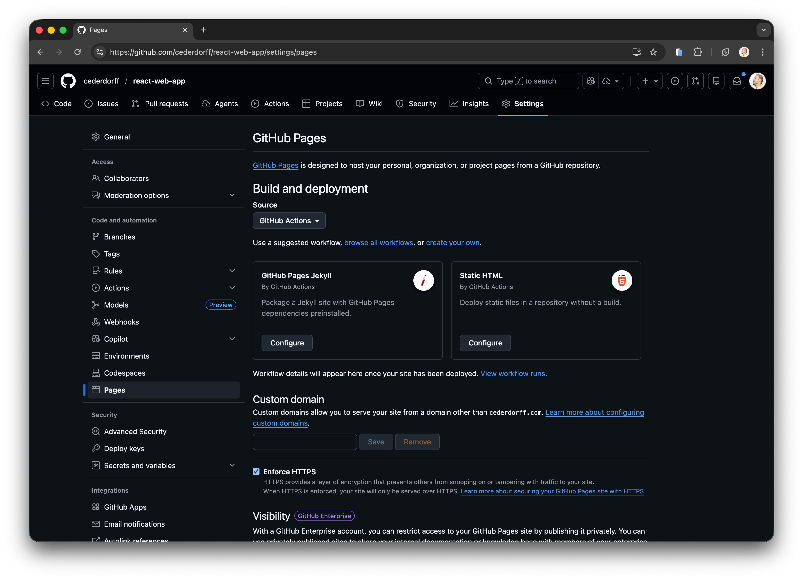
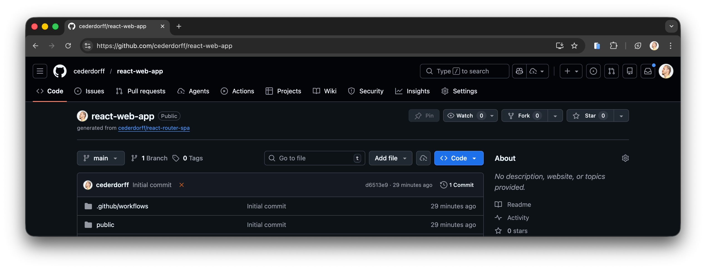

# Getting Started Guide

This guide walks you through creating your own project from this template and deploying it to GitHub Pages.

## 1. Use the Template

1. Open the template repository: https://github.com/cederdorff/react-router-spa
2. Click **Use this template** -> **Create a new repository**.
3. Enter a repository name (for example, `customer-experience`).
4. Set visibility to **Public** (recommended for GitHub Pages and for RACE access).
5. Click **Create repository**.

## 2. Enable GitHub Pages

1. In your new repository, go to **Settings**.
2. In the left menu, click **Pages**.
3. Under **Build and deployment**, set **Source** to **GitHub Actions**.
4. Enable **Enforce HTTPS**.



## 3. Clone the Repository

1. Go to the repository front page (**Code** tab).
2. Click **Code** -> **Open with GitHub Desktop**.
3. In GitHub Desktop, choose where to save the project.
4. After cloning, click **Open in Visual Studio Code**.



## 4. Run the Project Locally

In the project folder, in VS Code, run:

```bash
npm install
npm run dev
```

Then open the local URL shown in the terminal and verify the app works in your browser.

## 5. Configure the Base Path

1. Open `package.json`.
2. Find the `base` field.
3. Set it to your repository name, with a leading and trailing slash:

```json
"base": "/my-repo-name/"
```

Example: if your repository is `react-web-app`, use:

```json
"base": "/react-web-app/"
```

4. Optional: update `"name"` to match your project name (without slashes).


## 6. Commit and Push

1. In GitHub Desktop, write a commit message.
2. Click **Commit to main**.
3. Click **Sync Changes** (push to GitHub).


## 7. Verify Deployment

1. In GitHub, open the **Actions** tab.
   
2. Wait for the deploy workflow to complete successfully.
3. Open the finished workflow run.
   
4. Click the deployed URL and test the site in your browser.
     
   

Deployment complete.
